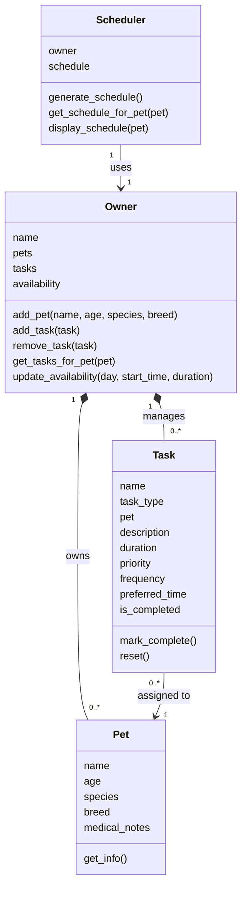

# PawPal+ Class Diagram

```mermaid
classDiagram
    class Owner {
        name
        pets
        tasks
        availability
        add_pet(name, age, species, breed)
        add_task(task)
        remove_task(task)
        get_tasks_for_pet(pet)
        update_availability(day, start_time, duration)
    }

    class Pet {
        name
        age
        species
        breed
        medical_notes
        get_info()
    }

    class Task {
        name
        task_type
        pet
        description
        duration
        priority
        frequency
        preferred_time
        is_completed
        mark_complete()
        reset()
    }

    class Scheduler {
        owner
        schedule
        generate_schedule()
        get_schedule_for_pet(pet)
        display_schedule(pet)
    }

    Owner "1" *-- "0..*" Pet : owns
    Owner "1" *-- "0..*" Task : manages
    Task "0..*" --> "1" Pet : assigned to
    Scheduler "1" --> "1" Owner : uses
```
