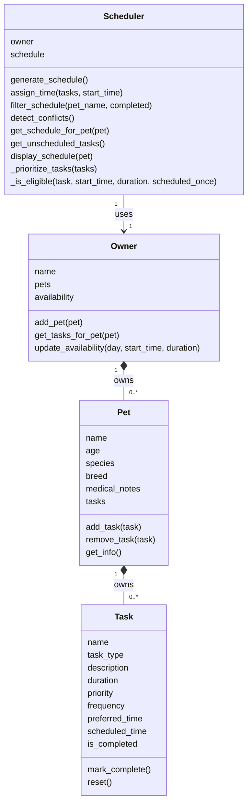

# PawPal+ Class Diagram (Final)

```mermaid
classDiagram
    class Owner {
        name
        pets
        availability
        add_pet(pet)
        get_tasks_for_pet(pet)
        update_availability(day, start_time, duration)
    }

    class Pet {
        name
        age
        species
        breed
        medical_notes
        tasks
        add_task(task)
        remove_task(task)
        get_info()
    }

    class Task {
        name
        task_type
        description
        duration
        priority
        frequency
        preferred_time
        scheduled_time
        is_completed
        mark_complete()
        reset()
    }

    class Scheduler {
        owner
        schedule
        generate_schedule()
        assign_time(tasks, start_time)
        filter_schedule(pet_name, completed)
        detect_conflicts()
        get_schedule_for_pet(pet)
        get_unscheduled_tasks()
        display_schedule(pet)
        _prioritize_tasks(tasks)
        _is_eligible(task, start_time, duration, scheduled_once)
    }

    Owner "1" *-- "0..*" Pet : owns
    Pet "1" *-- "0..*" Task : owns
    Scheduler "1" --> "1" Owner : uses
```
